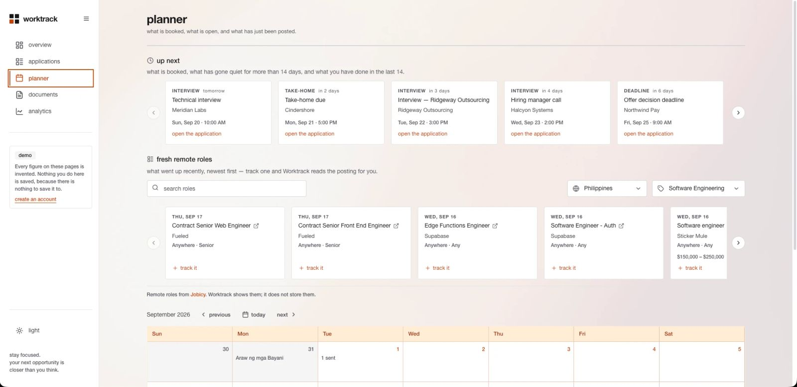
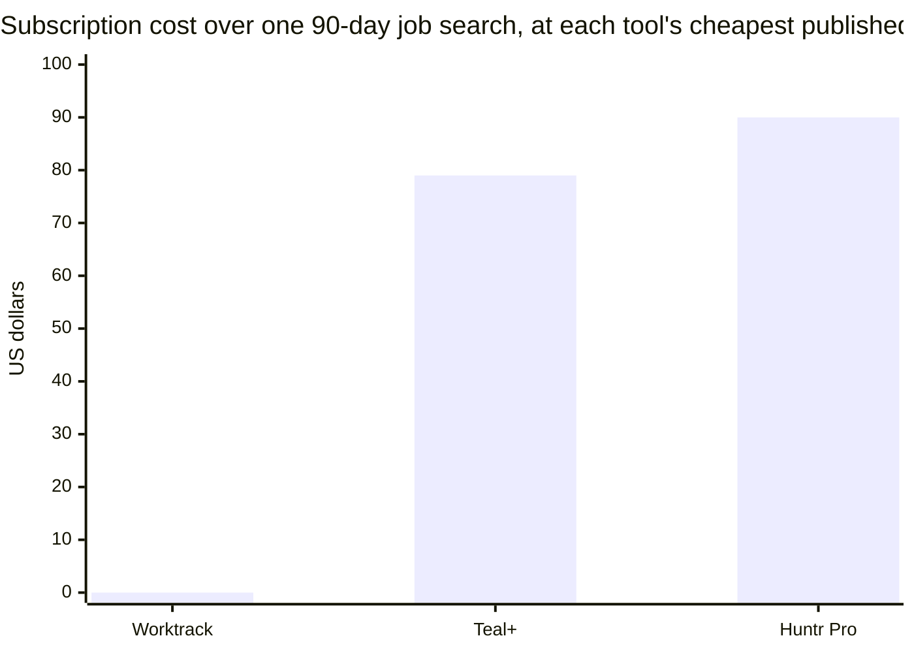

<p align="center">
  <picture>
    <source media="(prefers-color-scheme: dark)" srcset="public/brand/worktrack-mark-dark.svg" />
    
  </picture>
</p>

<h1 align="center">Worktrack</h1>

<p align="center">
  <strong>Live: <a href="https://worktrack-jobs.vercel.app">worktrack-jobs.vercel.app</a></strong>
</p>

A job search tracker with analytics and a CV builder, built with Next.js 15 (App Router) and React 19 over Supabase Postgres. Worktrack keeps every application, every status change, and every version of your CV in one place, with row-level security scoping every row to its owner.

> **Project lineage.** This repository is the continuation of the [Job Search Tracker & Analytics Dashboard](https://github.com/Ensues/Job-Search-Tracker-Analytics-Dashboard) originally created and built by **[Ensues (Janssen Quiambao)](https://github.com/Ensues)**, who authored the application and its features between March and May 2026. Development continues here under [@NightServant](https://github.com/NightServant). See [Credits](#credits).

## 1. App Overview

Worktrack is a full-stack application with an account behind it, which is the main thing separating it from a spreadsheet: the pipeline, the analytics and the CV history are all views over the same rows, and a status change recorded once shows up in the board, the timeline and the funnel without being entered three times.

Behind authentication sit `/overview`, `/applications`, `/applications/[id]`, `/planner`, `/documents`, `/documents/templates`, `/cv`, `/analytics` and `/settings`. In front of it are the landing page at `/`, `/login` and `/signup`, the read-only demo at `/demo/*`, and `/privacy`.

**Data belongs to one person and the database enforces it.** Row-level security is enabled on every table and every policy scopes rows to `auth.uid()`, so a request for someone else's row returns nothing rather than being filtered out afterwards by the interface. That holds even when the application asks for the wrong thing, which is the point of putting it there rather than in a service layer.

**You do not need an account to see the product.** [`/demo/overview`](/demo/overview) serves the real screens over invented data from `src/lib/demoFixture.ts` — a file in this repository, so there is no session, no database connection and no write path behind those pages. That is a stronger guarantee than a read-only account and a much smaller one to make: no credentials to publish, nothing to vandalise, and `git checkout` is the entire reseeding procedure.

## 2. Brand

### Icon

The Worktrack mark is a 2×2 grid of rounded cells with one cell in the accent colour — a literal reference to one stage of the status pipeline being active. It is not a text-only logo; the mark stands alone at small sizes.

| Asset | Purpose |
|---|---|
| [`public/brand/worktrack-mark-light.svg`](public/brand/worktrack-mark-light.svg) | The mark for light backgrounds — documentation and external material |
| [`public/brand/worktrack-mark-dark.svg`](public/brand/worktrack-mark-dark.svg) | The same mark for dark backgrounds |
| [`src/app/icon.svg`](src/app/icon.svg) | Wired into Next.js as the favicon |
| [`src/components/ui/brand-mark.tsx`](src/components/ui/brand-mark.tsx) | The mark in the app itself |

The two SVG files above exist **only for this README**. The app's mark needs no variants: its three static cells use `currentColor` and its accent cell binds to `var(--color-accent-default)`, so it follows the theme on its own. An `` on GitHub gets neither a CSS context nor an inherited colour, so the two themes need two files and a `<picture>` element to choose between them.

### Color palette

Worktrack is Swiss typography with a single orange accent, and it renders in both themes. Tokens are authored in [`src/index.css`](src/index.css); each semantic token below resolves to a different primitive per theme, which is why the table has two hex columns rather than one.

| Token | Light | Dark | Used for |
|---|---|---|---|
| `--color-accent-default` | `#c2410c` | `#fb923c` | The one accent: primary buttons, active nav, links, the mark's active cell |
| `--color-bg-canvas` | `#ffffff` | `#09090b` | The page ground |
| `--color-bg-surface` | `#fafafa` | `#18181b` | Alternating section grounds, the auth brand panel |
| `--color-text-primary` | `#18181b` | `#fafafa` | Headings and body text |
| `--color-text-secondary` | `#3f3f46` | `#d4d4d8` | Supporting copy |
| `--color-border-subtle` | `#e4e4e7` | `#27272a` | Hairline rules between rows and sections |
| `--color-border-default` | `#d4d4d8` | `#3f3f46` | Field borders |

Two rules are load-bearing rather than stylistic. **Orange-500 is absent from the codebase**: it fails AA against both of its foregrounds, so the accent resolves to orange-700 in light and orange-400 in dark, each of which clears it. And **the radius is capped at 4px everywhere** — this system separates things with hairline rules rather than rounded, shadowed cards, so a softer corner on one control reads as a different design system. A test fails any component that exceeds either.

## 3. Screens

Captured from the running application, not mocked up.

| | |
|---|---|
|  |  |
| **`/overview`** — what is moving, what has stalled, what is next | **`/applications`** — the pipeline as a board or a table |
|  |  |
| **`/analytics`** — conversion, time-in-stage and source trends | **`/documents`** — CV versions and what was sent where |



**`/planner`** — interviews, deadlines and take-homes.

## 4. Demo

[`/demo/overview`](/demo/overview) — the app's real screens over invented data. No account, no sign-in, nothing to enter.

It is a public URL space rather than a shared account. Every figure comes from `src/lib/demoFixture.ts`, so the routes are statically rendered and opening the demo serves HTML rather than a spinner.

The screens' write controls (new application, import, delete) still render, because they are the *real* screens rather than a reduced copy. They explain themselves instead of writing: silence would be indistinguishable from a broken button.

The dates move with the clock. A fixture pinned to literal dates would say "applied 8 months ago" by spring, and the six-month trend chart would run off its own left edge.

## 5. Features

### Job tracking
- Applications with company, role, salary range, location, work mode, source, tags, and tech stack
- Status pipeline — wishlist → applied → interviewing → offer / rejected — shown as a progress bar on every application and as filter tabs over the list
- Automatic status-change history, recorded by a database trigger rather than by the client, so a transition cannot be lost by a failed request
- Auto-fill from a job posting URL, parsed server-side. Three routes in, tried in order of what the answer is worth: the board's own structured data where it publishes any, then a hosted fetcher (Firecrawl) for pages this server cannot open, then the page rendered by a browser. JobStreet and SEEK refuse the HTML to everything that is not a browser and answer the same posting at their own `/graphql`, so that is what gets asked
- A bookmarklet for the boards none of those routes reaches. It opens Worktrack on the add flow and hands over the page your browser is already showing, so an Indeed posting fills in like any other — not a scraper pretending to be a person, but the person. A bookmarklet rather than an extension because an extension is a store listing, a review queue and an update channel for what is, in the end, a line of `outerHTML`: this installs by dragging a link and uninstalls by deleting a bookmark
- A posting that genuinely cannot be read says so, names the board, and points at the employer's own careers page — which parses better than any aggregator mirror anyway
- Search, ordering by date applied or alphabetically, pagination, and CSV **import and export**
- One record dialog that reads and edits the same application: what the job is, the posting itself, and how your CV scores against it

### Calendar
- **`up next` opens the screen**: what is booked, then what has gone quiet, then what recently happened. The middle one is why it exists — an account with fifty applications and no interviews booked yet has no events at all, so a rail reading the calendar alone was empty for the person using the app hardest. Anything in flight and untouched for 14 days is a chase, by the same rule the overview's nudge uses rather than a second copy of it
- Interviews, deadlines, take-homes and follow-ups on a month grid, with a week strip and an agenda on a phone
- Setting an application's status to *interviewing* takes a date and time, which writes the interview to the calendar
- Applications you sent are plotted on the day you sent them
- Public holidays for your country, from [Nager.Date](https://github.com/nager/nager.date) — keyless, and settled by a picker. It opens on the machine's time zone rather than its language, and a bare `en` yields nothing rather than being maximised to `US`: a language tag says what somebody reads, not where they are
- A rail of newly posted remote roles from [Jobicy](https://jobicy.com), below your own commitments rather than above them; *track it* hands the URL to the add flow, which reads the employer's own page

### Analytics
- Conversion and offer rates, applications over time, status distribution
- Time-in-stage metrics, conversion funnels, and source trends
- A date range that narrows every panel on the screen, not just one
- Every panel is computed from your rows on request, then held by TanStack Query for 5–10 minutes (stale-while-revalidate)
- Every figure is computed from your own rows, so it is only ever as good as what you put in

### CV builder
- Word-style rich text editor (Tiptap). **There is no Save button**: the document writes itself 1200ms after you stop typing, the header says where the work stands, and ⌘S says so too rather than letting the browser offer to save the page
- LaTeX source editor with live side-by-side preview
- Template presets for both modes, browsable on their own screen
- Grammar, spelling and style checks over the open document, from LanguageTool's keyless public endpoint. The browser calls it directly rather than through this server, because the free tier is rate limited per IP and a proxy would put every user behind one address
- Version history — snapshots capped at 10 per CV
- Export to `.tex`, `.docx` or PDF — three Next.js routes, with no headless browser between you and the file
- An ATS check that reads the document rather than guessing at it, and names both the matched and the missing keywords
- Tailoring against a job description, through your own OpenAI-compatible endpoint rather than a credit meter. Unset the `TAILORING_*` variables and every model feature switches off and says why, rather than failing at the point of use

### Profile
- **Several public addresses, read and merged into one profile**: LinkedIn, GitHub, JobStreet, Indeed and Glassdoor. One source is half a person — a signed-out LinkedIn page carries roles and dates and no skills at all, while GitHub carries what you have built and in which languages and has no concept of employment
- The order of the rows is authority rather than arrival. The first non-empty value wins each field, lists are unioned, and the same role from two sources is matched and then filled in field by field. Nothing is overwritten with emptiness, which is what makes adding a source safe
- GitHub is read from its own JSON API rather than scraped — keyless, structured and free, where the other sources need a paid hosted browser to see anything at all. Its profile README is read too: the opening paragraph, and the stack named on its badges
- What each source withholds is said on that source's own row, after the read. Two of the five do not publish a candidate profile to a signed-out visitor at all. A warning states the limit and prescribes nothing — every remedy this app has ever named on one of those rows has outlived its own sentence
- A bookmarklet hands over your own LinkedIn page from the session already looking at it, along with the `/details/` subpages, because the profile page itself renders only the first two or three of a long section. **Chrome will not run it on LinkedIn**: the site's content security policy names script hashes and hosts with no `unsafe-inline`, so the browser lands on `about:blank#blocked` instead. Firefox exempts bookmarklets from CSP and does run it. The posting bookmarklet is unaffected

### How Worktrack compares

Worktrack is not trying to out-feature the commercial trackers. It is trying to be the one you can run yourself, over a database you own, without a per-item credit meter. This section says where that trade lands — including where it loses.

**Everything below was read from each product's own pricing page on 10 September 2026** — [tealhq.com/pricing](https://www.tealhq.com/pricing) and [huntr.co/pricing](https://huntr.co/pricing) — and the rows say *listed* or *not listed*, never *has* or *lacks*. A pricing page is a marketing document, not an inventory: something missing from it may still exist in the product. Prices change; re-check before quoting these.

#### What each free tier gives you

| | **Worktrack** | **Teal** (Free Forever) | **Huntr** (Free) |
|---|---|---|---|
| Applications tracked | no cap in the app; your Postgres quota is the ceiling | unlimited | up to 100 |
| CVs | no cap in the app | unlimited | unlimited base résumés |
| CV templates | Word **and** LaTeX presets (see the Templates screen) | 10 | all templates |
| Job-description keyword matching | every keyword, matched and missing, against the CV you linked | top 5 keywords | basic |
| AI generations | your own API key, unmetered by us | 10 bullet credits, 2 summary, 2 cover letter | limited credits, then paid |
| Tailored CVs | limited only by your own API key | unlimited résumés, top-5 matching | 2 |
| Document uploads | your Supabase storage quota | not listed | up to 100 |

#### What each one charges to lift those limits

| | Worktrack | Teal+ | Huntr Pro |
|---|---|---|---|
| Cheapest published term | — | **$79** / 90 days | **$90** / quarter ($30/mo) |
| Monthly | — | $29 / 30 days | $40 / month |
| Weekly | — | $13 / 7 days | — |
| 90 days at the cheapest term | **$0** | **$79** | **$90** |



**$0 is a subscription figure, not a running cost, and the difference matters.** Worktrack charges no subscription because you host it — so you pay your own providers instead:

| What you run | What it costs |
|---|---|
| Vercel Hobby + Supabase free tier | $0 on the free tiers this project is built to fit |
| CV tailoring | your own OpenAI-compatible endpoint, at your provider's rate — or a local model, at nothing |
| Job-posting fetch fallback ([Firecrawl](https://firecrawl.dev)) | optional; the app works without a key and says so |
| LinkedIn profile import ([Apify](https://apify.com)) | **~$0.51 per profile**, measured — see [`scraper/extractor/apify_profile.py`](scraper/extractor/apify_profile.py) |
| Public holidays, remote-job feed | $0 — both are keyless public APIs |

#### What Worktrack does that neither page lists

- **A LaTeX CV editor** with a live side-by-side preview and PDF output, alongside the Word-style one
- **Public holidays on the calendar**, per country, from a keyless open-source API
- **A rail of newly posted remote roles** inside the tracker, where *track it* hands the URL to the add flow and the app reads the employer's own page
- **Self-hosting on your own Supabase project**, with row-level security scoping every row to its owner — nobody's terms of service sit between you and your applications
- **Bring-your-own model key**, so AI is billed by your provider rather than metered as credits
- **CSV import as well as export**, so the spreadsheet you already keep is a starting point rather than a thing you retype

#### What they do that Worktrack does not

Stated plainly, because a comparison that only runs one way is an advertisement:

- **A browser extension.** Both list one; Huntr's "Chrome Job Clipper" saves a posting in a click and its **application autofill** fills employer forms for you. Worktrack has no extension, and a bookmarklet covers the clipper's half of that — one click hands over the posting your browser is already showing, which is the only way to read a board that answers a server with a challenge. It installs by dragging a link rather than through a store listing and a review queue. Nothing here fills an employer's form for you.
- **A job board of their own.** Teal and Huntr surface listings and company data in-product. Worktrack shows a third-party remote feed and nothing else.
- **Contact management.** Huntr lists it as unlimited on the free tier. Worktrack removed contacts from the record on purpose; the columns still exist, nothing renders them.
- **AI cover letters.** Both list generation; Worktrack tailors CVs and does not write cover letters.
- **Maturity.** Support, a company behind it, and years of iteration. Worktrack is one person's project.

#### Check the rest yourself

The figures above are quoted with the date they were read, because somebody else's pricing page is not something this repository can recompute. Its **own** numbers are a different matter — a count typed into a README is wrong by the next commit, so here is where to get each one live instead:

| | Where it comes from |
|---|---|
| Test suite, TypeScript | `npm test` |
| Test suite, Python extractor | `npm run test:scraper` |
| Database migrations | `ls supabase/migrations/*.sql` |
| API routes (there are no edge functions) | `find src/app/api -name route.ts` |
| Routes behind authentication | `find "src/app/(app)" -name page.tsx` |
| CV templates, per mode | [`src/services/resumeTemplateService.ts`](src/services/resumeTemplateService.ts) |
| Supported currencies | [`src/services/userPreferences.ts`](src/services/userPreferences.ts) |

This is the same rule the landing page follows and `src/lib/__tests__/attribution.test.ts` enforces: a claim nothing recomputes is a claim that rots, and this README shipped a stale test count once already.

### Accounts
[Sign in](/login) or [create an account](/signup). Registration is three steps — credentials, a six-digit code sent to the address, then the overview — with the password rules shown on the form and checked as you type.

The same rules are enforced by the database and not only by the browser: `minimum_password_length` and `password_requirements` in [`supabase/config.toml`](supabase/config.toml) mirror `src/lib/credentials.ts`, because a rule the browser enforces and the server does not is a rule anyone can skip with `curl`.

Email addresses are normalised — trimmed and lowercased — before anything leaves the browser. Without that, `Gabe@example.com` and `gabe@example.com` are two accounts, and walking the case permutations of one address is a way to create a great many rows that all belong to one person.

## 6. Localhost Installation

Worktrack requires **Node.js 18+**, a Supabase project, and the [Supabase CLI](https://supabase.com/docs/guides/local-development).

```bash
git clone <repository-url> worktrack
cd worktrack

npm install
cp .env.example .env      # then fill in the two Supabase values
npm run dev
```

The dev server starts at <http://localhost:3000>.

`npm run dev` starts Next and nothing else. Auto-fill reads job postings through a separate Python service, so it stays unavailable until that is running too — and the symptom, before the app learned to say so, was auto-fill blaming perfectly good posting URLs:

```bash
python3 -m venv scraper/.venv
scraper/.venv/bin/pip install -e './scraper[dev]'
npm run dev:scraper        # http://127.0.0.1:8000, reloads on edit
```

Add `[dev,browser]` instead of `[dev]` to install the local browser as well. It is what reads boards that publish nothing structured, and it is a developer's convenience rather than part of a deployment: the Python builder installs `playwright` and never its Chromium, so a deployment uses `FIRECRAWL_API_KEY` for the same job.

Apply the schema before first use:

```bash
supabase link --project-ref <your-project-ref>
supabase db push
npm run seed:demo         # optional; populates the demo account
```

Other scripts:

```bash
npm run build              # production build
npm start                  # serve the production build
npm run lint               # eslint
npm test                   # the unit suite, single run
npm run test:watch
npm run test:integration   # against a live Supabase project; SKIPS without TEST_USER_* in .env
npx tsc --noEmit           # types, including every test file
```

**The integration suite is dormant, and that is worth knowing before you trust
a green run of it.** Its twenty tests are the only ones that touch the real
database: fifteen in `rlsSecurity.integration.test.ts` act as a stranger
holding the anon key — which ships in every browser by design — and assert that
each of the eleven user tables returns nothing, and that anonymous insert,
update and delete are all refused against a row that genuinely exists. The
other five round-trip the M2 services and a tailored CV.

They need a dedicated Supabase account, and there is not one: `TEST_USER_EMAIL`
and `TEST_USER_PASSWORD` are blank, so `describeIntegration` resolves to
`describe.skip` and all twenty report as skipped. `npm test` never sees them at
all — `vitest.config.ts` excludes `**/*.integration.test.ts` — so this does not
show up as a failure anywhere.

Nothing is broken; it is unconfigured. Create the account, fill in those two
variables, and all twenty run with no code change. Until then the RLS policies
are covered by their own definitions and by review, not by an executable check.

`tsc` covers `src/**/__tests__/**` deliberately. The exclusion that used to hide type errors in test files is gone, and a guard test fails if it comes back.

Two things about the local setup look decorative and are not, each of which cost a debugging round:

- **Stop the dev server before `npm run build`.** They share `.next`, and running both at once fails the build with `Cannot find module for page: /settings` — an error that names a route and has nothing to do with that route.
- **`npm run lint` walks into `venv/`.** It is `eslint .`, and the Python analysis virtualenv in the working tree is not excluded, so it reports thousands of problems from bundled matplotlib JavaScript. Lint the files you changed until the flat config ignores it.

No test count is quoted anywhere in this file, on purpose: the previous README claimed one that was wrong within a day and stayed wrong for a milestone. `src/lib/__tests__/attribution.test.ts` now fails any attempt to put a figure back.

## 7. Configuration

| Variable | Effect when unset |
|---|---|
| `NEXT_PUBLIC_SUPABASE_URL` | The app cannot reach the database. Required. |
| `NEXT_PUBLIC_SUPABASE_ANON_KEY` | The app cannot authenticate. Required. |
| `SUPABASE_AUTH_SITE_URL` | Only read by `supabase config push`. It has **no default on purpose**: an unset value fails the push loudly rather than pointing production auth emails at `localhost`. |
| `EXTRACTOR_URL` | Auto-fill answers 503 and says so. It is a Vercel service binding in [`vercel.json`](vercel.json); locally it is `http://127.0.0.1:8000` and `npm run dev` does **not** start that service — `npm run dev:scraper` does. |
| `FIRECRAWL_API_KEY` | The hosted fetcher is skipped. Read by the extractor, not by the app. Boards that refuse an ordinary request fall through to a local browser, which exists on a developer's machine and not in a deployment — so without this, Indeed is unreadable in production. The skip is logged rather than reported as the board blocking us. |
| `TAILORING_BASE_URL`, `TAILORING_API_KEY`, `TAILORING_MODEL` | Every model feature switches off and says why. Any OpenAI-compatible chat endpoint: OpenRouter, Groq, Together, a local Ollama. |
| `MODEL_EXTRACT`, `MODEL_CV`, `MODEL_TAILOR` | Each falls back to `TAILORING_MODEL`. They are three different jobs — reading a posting against a schema, writing prose, and judging what may honestly be claimed — and they want different models. |
| `TAILORING_ENABLED` | Absent means on. `false` is how a Preview deployment is told not to spend the shared key on a branch. |

**One provider difference worth knowing before you swap endpoints.** OpenRouter documents two spellings for reasoning effort and they are not interchangeable: Groq answers the nested `reasoning: { effort }` with `400 property 'reasoning' is unsupported`, which costs the whole call. Everything here sends the flat OpenAI-style `reasoning_effort`, and the tests assert the nested form is absent.

`NEXT_PUBLIC_SUPABASE_ANON_KEY` is in the client bundle, and that is correct. Next inlines any `NEXT_PUBLIC_` variable, the anon key is designed to be public, and row-level security — not key secrecy — is what protects the data. Never put the service-role key behind that prefix; it bypasses RLS entirely.

### Auth configuration

Auth settings live in [`supabase/config.toml`](supabase/config.toml) and the email templates beside it, so they are reviewable and revertible rather than clicked into a dashboard:

```bash
SUPABASE_AUTH_SITE_URL=https://your-deployed-origin npx supabase config push
```

**Read [`docs/SECURITY.md`](docs/SECURITY.md) before running that.** `config push` sends the whole file, and the file was generated from CLI defaults, so anything left at a default overwrites what the dashboard currently has.

The signup OTP will not work on a stock Supabase project. The default "Confirm signup" template contains `{{ .ConfirmationURL }}` and no token, so no code is ever sent and verification fails against a code that never existed. [`supabase/templates/confirmation.html`](supabase/templates/confirmation.html) is the fix, and the `config.toml` entry is what applies it.

### Deployment

Vercel. Import the repository, set the two `NEXT_PUBLIC_SUPABASE_*` variables, and deploy. The landing page, `/privacy` and the 404 are statically prerendered; the authenticated routes render on demand.

[`vercel.json`](vercel.json) declares **two services**, not one: the Next app and the Python extractor, with a service binding that injects `EXTRACTOR_URL` into the app. That is why `EXTRACTOR_URL` does not appear in the project's environment variables and should not be added there. The model and Firecrawl keys are ordinary environment variables and do have to be set.

## 8. Engineering

**Row-level security on every table.** Twelve tables, twelve `ENABLE ROW LEVEL SECURITY`, and every policy scoped to `auth.uid()`.

**Every route that costs something authenticates its caller.** This was found in the edge functions the app used to have: three of the four checked, and `job-url-autofill` did not — while fetching arbitrary external URLs server-side, which is a fetch proxy on our infrastructure open to anyone who found the URL. The trap worth naming is that Supabase's platform-level `verify_jwt` would not have caught it: **the anon key is itself a valid JWT and it is public by design**, so a gate that only asks "is this a valid JWT" admits the entire internet. Only `getUser()` separates a signed-in person from anyone who has read the client bundle. Those functions are gone; the rule moved to `lib/apiAuth`, which every `/api` route calls before it reads a body, and which logs each refusal.

**Tests are written before the code, and proved to have teeth.** The habit that matters is not the count but the check: a test that cannot fail is worse than no test, so a new guard is verified by reverting the fix and watching it go red. Several tests in this repository exist because an earlier version passed against broken code.

**Constraints are enforced by tests, not by convention.** No `lucide-react` import, no radius above 4px, no `orange-500`, no colour literal in the auth brand panel, no type size picked outside the landing page's contract, and no privacy-policy claim about a table the schema does not have.

## 9. Data analysis

An optional Python script produces statistics and charts from exported CSV data.

```bash
python3 -m venv venv
./venv/bin/pip install pandas matplotlib seaborn
cd scripts && ../venv/bin/python data_analysis.py
```

Export your applications as CSV and place the file in `scripts/`. Without one, the script runs on built-in sample data and reports fabricated numbers — check the output for the "Generating sample data" notice.

## 10. Project structure

```
src/
├── app/            Next.js App Router
│   ├── (app)/      authenticated routes and their shell
│   ├── (auth)/     /login and /signup
│   ├── demo/       the public read-only route space
│   ├── privacy/    the privacy page
│   └── not-found.tsx
├── components/
│   ├── ui/         the design system (shadcn base-nova, retokened)
│   ├── icons/      AnimateIcons, behind one barrel
│   ├── landing/    the landing page and its sections
│   ├── auth/       the auth screens and the registration flow
│   ├── shell/      sidebar, bottom nav, app chrome
│   ├── brand/      provider marks; fixed artwork, not design-system icons
│   ├── v1/         vendored third-party sources, credited below
│   └── …           analytics, applications, calendar, cv, documents, settings
├── contexts/       auth, theme, toast
├── hooks/          data hooks over TanStack Query
├── lib/            Supabase client, credentials, rate limiting, helpers
└── services/       data access, validation, templates, analytics
supabase/
├── migrations/     ordered SQL migrations
├── templates/      auth email templates
└── config.toml     auth configuration, applied with `supabase config push`
scripts/            demo seeding and the Python analysis
docs/               SECURITY.md and the milestone plans
```

## 11. Stack

| Layer | Technology |
|---|---|
| UI | React 19, TypeScript, Next.js 15 (App Router) |
| Components | shadcn/ui (`base-nova` style, built on Base UI) |
| Icons | AnimateIcons |
| Styling | Tailwind CSS v4, semantic design tokens in `src/index.css` |
| Motion | motion (formerly framer-motion) |
| Data fetching | TanStack Query v5 |
| Editor | Tiptap |
| Charts | Recharts 3 |
| Database | PostgreSQL (Supabase) |
| Auth | Supabase Auth |
| Server-side | Next.js route handlers (`src/app/api`) |
| Posting extraction | Python (FastAPI) in [`scraper/`](scraper), run as its own service |
| Testing | Vitest, React Testing Library |
| Analysis | Python (pandas, matplotlib, seaborn) |

### Database

Twelve tables, RLS enabled on all of them:

| Table | Purpose |
|---|---|
| `jobs` | Applications, with description, currency, contact and tag fields |
| `job_status_history` | Append-only status transitions, written by trigger |
| `activity_log` | Free-form timestamped notes per application |
| `events` | Interviews, deadlines, take-homes |
| `resumes` | CV drafts; structured sections, Tiptap JSON, or LaTeX |
| `resume_snapshots` | Immutable version history |
| `application_documents` | Which CV snapshot was sent to which application |
| `contacts` / `application_contacts` | Recruiters and referrals, linked many-to-many |
| `user_preferences` | Per-user settings; default currency for new applications |
| `demo_accounts` | Read-only demo users, enforced by RLS |

### Edge functions — there are none

Four Deno functions used to live in `supabase/functions/`. **Not one of them
was ever deployed**: `list_edge_functions` returns an empty list for this
project, which is also why a call to one surfaced as `TypeError: Failed to
fetch` rather than a 404 — Supabase's platform 404 answers the CORS preflight
without `content-type`, so the browser drops the request before there is a
status to report.

They were removed rather than deployed, each for its own reason:

| Function | Gone because |
|---|---|
| `resume-export-pdf` | Bundled Chromium against a 256MB runtime and a 20MB bundle cap. Now `/api/cv/pdf` |
| `cv-render` | The same, for the same reason |
| `job-url-autofill` | Superseded by `/api/autofill` and the extractor service (M7) |
| `analytics-cache-proxy` | Superseded by live compute in `analyticsService` — see `useAnalytics` for why deploying it would have been worse than deleting it |

The work they were meant to do runs where it can be tested from a laptop:
`/api/cv/pdf`, `/api/cv/docx`, `/api/cv/latex`, `/api/autofill` and
`/api/tailor`.

## 12. Limitations

- **Leaked-password protection is a Pro feature, and is therefore off.** Supabase checks new passwords against HaveIBeenPwned only on paid plans; the toggle renders and refuses to save. The length and character rules are enforced server-side, so what is missing is specifically the "this password is already on a list" check — which no client-side rule can honestly provide, so none is pretended. The same gate keeps server-side session expiry off; see [`docs/SECURITY.md`](docs/SECURITY.md).
- **There is no third-party sign-in.** Email and password only. Google and Microsoft buttons existed and were deleted once it was established that neither provider had ever been enabled on the project — a control that cannot work reads as a broken app rather than a feature that is not set up.
- **Client-side rate limiting is an affordance, not a boundary.** `src/lib/authRateLimit.ts` throttles repeated attempts from one browser and anyone with a console walks past it. The real boundary is server-side, and `docs/SECURITY.md` tables the dashboard controls that have to be switched on.
- **`/` still paints for a frame when a session appears mid-visit.** The frame this list used to describe is gone: sessions have been cookie-backed via `@supabase/ssr` since 2026-09-11, so [`src/middleware.ts`](src/middleware.ts) reads the cookie and redirects a signed-in visitor before the landing page is generated. What remains is the case middleware structurally cannot see — a session that comes into existence *while* the page is open, where there was nothing to redirect at request time. `SignedInRedirect` catches that one after hydration, which is why the component is still mounted on `/`, `/login` and `/signup`.
- **`resumes.sections` is never written**, so the ATS column reads "not checked" for CVs created through the editors.
- **No accessibility audit has been done.** Keyboard navigation and `aria-current` are handled on the primary surfaces, `prefers-reduced-motion` is honoured throughout, and colour is never the only carrier of state — but a full screen-reader pass has not happened.
- **Some job boards cannot be read from a server, and no amount of code changes that.** Indeed answers an anonymous request with a Cloudflare 401; JobStreet and SEEK answer 403. Where a board publishes its postings through its own API, that is used — the [posting extractor](scraper/extractor/seek_api.py) reads SEEK's own `/graphql` and the roles rail reads [LinkedIn's public guest search](scraper/extractor/linkedin_jobs.py), both unauthenticated and both asked plainly. Where a board publishes the answer into its own page instead, that is read where it is already given away — [JobStreet's search](scraper/extractor/jobstreet_jobs.py) ships its whole `jobSearchV7` response server-rendered into the HTML, so nothing is re-asked for. That reader still exists and is local-only, because the page needs a real browser a deployment has not got — so the rail's JobStreet half runs through a paid Apify actor instead, which puts both the crawling and the choice with the operator who runs it. JobStreet's `robots.txt` disallows the search paths, which is the better reason of the two. Where one does not, the hosted fetcher is tried, and where that fails too the app says which board refused and points at the employer's own careers page — which parses at 0.90–0.95 confidence a field, against 0.40–0.70 for an aggregator mirror even when the mirror *can* be read.
- **One route on the roles rail does wear a disguise, and this line used to deny it.** Until 2026-09-21 the sentence above ended "Nothing here wears a disguise: no challenge is solved, no session borrowed, no residential proxy bought." That was true of everything then in the tree and is no longer true of all of it. The rail's **Indeed** half now runs through [JobSpy](https://github.com/speedyapply/JobSpy) (MIT), whose Indeed module sends `indeed-api-key`, a credential extracted from Indeed's iOS app, behind that app's own user-agent with TLS verification disabled — `apis.indeed.com/graphql` is Indeed's *partner* API and officially wants a bearer token and a signed agreement. That was a deliberate choice, made knowing the alternative was a paid actor or nothing, and it is recorded here rather than left for somebody to find in `node_modules`. The licence covers JobSpy's code; it does not cover Indeed's key. Everything else on the rail — Jobicy, LinkedIn — is still read plainly, and [`scraper/extractor/jobspy_board.py`](scraper/extractor/jobspy_board.py) says which is which.
- **The pinned landing sequence is desktop-only.** Below `lg` nothing pins; the page scrolls normally, which is deliberate rather than unfinished.

## Licence

**MIT.** The full text is in [`LICENSE`](LICENSE); the short version is that you may use, copy, modify and redistribute this, including commercially, so long as the copyright notice travels with it. There is no warranty.

**Two copyright holders, not one.** This repository has had two authors and both hold copyright in what they wrote — see [Credits](#credits):

| | Wrote |
|---|---|
| [Janssen Quiambao (Ensues)](https://github.com/Ensues) | the original application, March – May 2026 |
| [Gabe Cervantes (@NightServant)](https://github.com/NightServant) | everything since August 2026 |

```bash
git shortlog -sne --all
```

No commit counts in that table on purpose — they change with every push, and this README already shipped one stale figure. The command above is the live answer, and it is what the two-name copyright line rests on: a grant signed by one author over another author's work would not be worth the file it is written in.

**What this licence does not cover** is the third-party material vendored into the repository — shadcn/ui, AnimateIcons, Arimo, the Pexels video and the Unsplash photograph all arrive under their own terms, which are listed in [Attribution](#attribution) and are unaffected by the MIT grant above. The services the app talks to (Nager.Date, Jobicy, Firecrawl, Apify, Supabase, Vercel) are nobody's to relicense either; see [`docs/INTEGRATIONS.md`](docs/INTEGRATIONS.md).

## Attribution

Third-party components and assets vendored into this repository, credited when adopted:

- **shadcn/ui** — MIT, [ui.shadcn.com](https://ui.shadcn.com). Component source copied into `src/components/ui/` under the `base-nova` style and edited to this project's tokens.
- **AnimateIcons** — MIT, [github.com/Avijit07x/animateicons](https://github.com/Avijit07x/animateicons). Icon components vendored via the shadcn CLI into `src/components/icons/`.
- **mammoth.js** — BSD-2-Clause, [github.com/mwilliamson/mammoth.js](https://github.com/mwilliamson/mammoth.js). An npm dependency rather than vendored source. Converts uploaded `.docx` files to HTML on the Documents screen, which `src/lib/documentImport.ts` walks into the editor's content. Chosen because it maps Word's *styles* rather than its formatting: Word marks a heading by naming a style, not by making text large, so a converter that reads formatting turns a CV into bold paragraphs.
- **loading-ui** — [loading-ui.com](https://loading-ui.com), "free and open source, forever"; the site states no attribution clause and publishes no licence file, so this credit is the same courtesy extended to the Pexels and Unsplash assets below. Its `analyzing-image` component was vendored from the registry into `src/components/ui/analyzing-document.tsx` and redrawn around this app's own document glyph, for the add-application wizard's "reading the posting" step. loading-ui credits the original animation to **dmytro** ([pqoqubbw](https://x.com/pqoqubbw/status/1913160002451153251)).
- **Arimo** — SIL Open Font License 1.1, self-hosted via `next/font`. The metric-compatible fallback for Helvetica Neue, which is licensed and cannot be self-hosted.
- **Hero video and its poster still** — [Pexels Licence](https://www.pexels.com/license/), free for commercial use with no attribution required; credited here anyway, as this repository credits third-party assets regardless. [Video 3129671](https://www.pexels.com/video/3129671/), vendored as `public/hero.mp4` (1280x720, H.264) and `public/hero-poster.jpg`. Rendered desaturated: this design system carries a single orange accent, and a second saturated hue behind the headline would make the accent read as one colour among several.
- **App backdrop photograph** — [Unsplash Licence](https://unsplash.com/license), photo by **Albert Salim** ([@albertsalim](https://unsplash.com/@albertsalim)), [photo-1751601454754](https://unsplash.com/photos/blurred-colors-blend-together-in-a-soft-abstract-pattern-XV7OUFLfB8Q). Vendored as `public/backdrop.jpg` and rendered by `AppBackground`. The licence does not require attribution; this repository credits third-party assets regardless.

### Skiper UI

UI components adapted from [Skiper UI](https://skiper-ui.com/components). Skiper
UI's free tier requires attribution, and the registry copies source in-tree
rather than installing a package, so the obligation attaches to the files below.
These two sentences are asserted verbatim by `src/lib/__tests__/attribution.test.ts`
and rendered by the landing footer, so the credit cannot drift from the code.

- Carousel adapted from Skiper UI (Creative carousel 002), built on Swiper.js, with illustrations by AarzooAly.
- Smooth caret input adapted from Skiper UI (Smooth caret input).

The theme toggle is not a Skiper component. It was written from scratch against
the technique in Skiper UI's theme toggle buttons — themselves adapted from
[toggles.dev](https://toggles.dev) by Alfie Jones — and the View Transition
theme wipe follows the approach in `rudrodip/theme-toggle-effect`. Neither
component's source ships here, so neither carries an attribution obligation;
both are named because the ideas are theirs.

---

## Credits

**Original author** — [Ensues (Janssen Quiambao)](https://github.com/Ensues) designed and built this application: the job tracker, analytics dashboard, CV builder, edge functions, and test suite.

**Current maintainer** — [@NightServant](https://github.com/NightServant), continuing development from August 2026: repository and branch consolidation, database migration history, schema fixes, and ongoing feature work.

Run `git shortlog -sne --all` for the full contribution breakdown.
